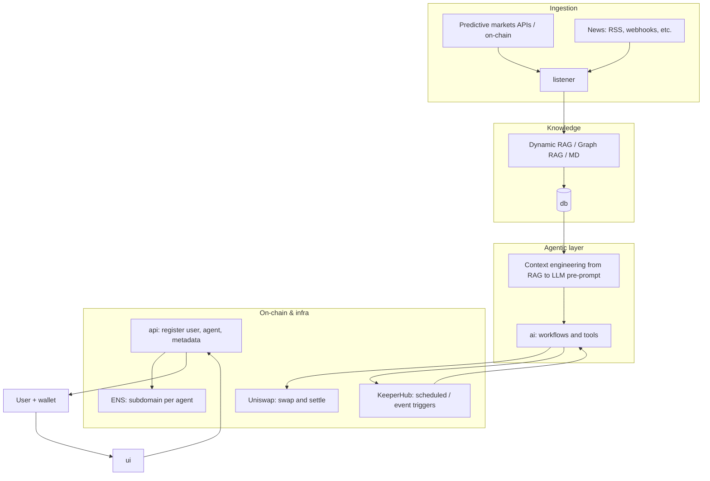

# Predictive Intelligence

**[ETHGlobal Open Agents](https://ethglobal.com/events/openagents)** (async, Apr 24–May 6, 2026) — domain-specialized agent teams, predictive markets, and on-chain execution.

## Overview

We are building a system where users **assemble teams of agents**, each with **domain expertise** (geopolitics, Ethereum, energy, sports, and more). Agents **ingest predictive-market and news data**, build a **shared knowledge base** (RAG, graph RAG, and curated markdown), and **act** on that knowledge: trades, swaps, market positions, and governance—optionally with **human-in-the-loop** validation. Payments, identity, and automation tie together **Uniswap** settlement, **ENS** per-agent identity, and **KeeperHub** for reliable scheduled and triggered execution.

## End-to-end flow

1. **Create a team of agents** — each agent is scoped to a domain and role.
2. **Pay the agent service** in **any supported crypto**; settlement routes through **Uniswap** (e.g. WETH → USDC) as needed.
3. **ENS subdomain per agent** — discoverable, human-readable identity for each agent in the system.
4. **Delegation or transfer of funds to an agent** so it can execute on the user’s behalf (within defined limits).
5. **Data & signals** — agents pull **predictive market** data and **domain news**; delivery includes **daily feeds** and **event-triggered** updates.
6. **Knowledge** — information is **structured and stored**; synthesis uses **RAG / Graph RAG** and **markdown** knowledge artifacts.
7. **Action** — agents use that knowledge to **take positions in prediction markets**, **swap** assets, **vote** (where applicable), and run other **tool-backed** workflows, with **optional human approval** for sensitive steps.

## Architecture (monorepo layout)

| Area | Role |
| --- | --- |
| **`listener/`** | “Listen the world” — ingest feeds, build knowledge, **trigger** the agentic workflow. |
| **`ai/`** | **Agentic workflow** — tool use, context assembly, planning, and execution. |
| **`api/`** | **Backend** — users, agent registration, ENS, metadata, orchestration APIs. |
| **`db/`** | **Storage** — proxies for on-chain data, RAG, Graph RAG, relational and/or document stores as needed. |
| **`ui/`** | **Front-end** — **wallet connect**, team setup, and **agentic run logs** / observability. |

## Blockchain & product integrations

- **ENS** — one **subdomain per agent**; ties agents to on-chain identity and discoverable metadata.
- **Uniswap** — a **tool** in the agent stack: pay in arbitrary tokens, normalize to a settlement asset (e.g. USDC), and support trading flows the agents require.
- **KeeperHub** — connect **reliable keepers** to the agentic workflow (daily runs, event-driven jobs, and maintenance tasks).

## Agent tools & use cases (trading & markets)

| UC | Description |
| --- | --- |
| **UC1** | Swap **any** token to support general trading. |
| **UC2** | Swap a **specific input** token into **USDC** for standardized accounting or execution. |
| **UC3** | Open or adjust a **position in a prediction market** using ingested + synthesized intelligence. |

All of the above are composable with **optional human validation** in the loop.

## Data & context engineering

- **Ingestion** — prediction markets: **public APIs and on-chain reads**; news: **RSS**, **webhooks**, and other feed mechanisms.
- **Storage** — **RAG**, **graph-enhanced RAG (Graph RAG)**, **dynamic** retrieval strategies, and structured stores so agents are not “stateless hallucinations” but **grounded** in evolving evidence.
- **Context engineering** — the **retrieved and structured knowledge** from the **dynamic RAG** (and related stores) is assembled into the **LLM’s pre-prompt and tool context** so every action is traceable to sources and state.

## Workflow & state design (cross-cutting)

- **State data structure** — what is persisted for each user, team, agent, and run.
- **Nodes** — clear definition of **workflow nodes** (inference, tool calls, human gates, on-chain steps) and transitions.

## Topics to investigate

| Track | Notes |
| --- | --- |
| **Data ingestion** | Prediction market APIs, on-chain event/indexing, news (RSS, webhooks). **Contact:** [jb.blanc@consensys.net](mailto:jb.blanc@consensys.net) |
| **Data storage** | RAG graph, dynamic RAG, durability and query paths. **Contact:** [kolhapure.satyajeet@gmail.com](mailto:kolhapure.satyajeet@gmail.com) |
| **Context engineering** | Feeding the dynamic RAG (and related context) into the model pre-prompt. **Contact:** [kolhapure.satyajeet@gmail.com](mailto:kolhapure.satyajeet@gmail.com) |
| **Agentic tools** | Uniswap swap/ settle, prediction market interaction, and composition of the three UCs. **All** |
| **Workflow & state** | State schema and node graph. **Leads:** [kolhapure.satyajeet@gmail.com](mailto:kolhapure.satyajeet@gmail.com), **Dayan (backup)** |
| **ENS, Uniswap, KeeperHub** | Identity, payment/settlement, and scheduled execution—each as a first-class integration. **All (see components above)** |

## Repository map

- [`listener/`](./listener/) — world-facing ingestion and triggers.  
- [`ai/`](./ai/) — agents, tools, and workflow execution.  
- [`api/`](./api/) — user and agent registration, ENS, and backend APIs.  
- [`db/`](./db/) — persistence and retrieval for RAG and app state.  
- [`ui/`](./ui/) — wallet, teams, and agentic logs.

## Status

This repo is a **work in progress** for the hackathon: interfaces and sub-readmes in each package will be filled in as the stack matures.

---

*Built for [ETHGlobal Open Agents](https://ethglobal.com/events/openagents).*
